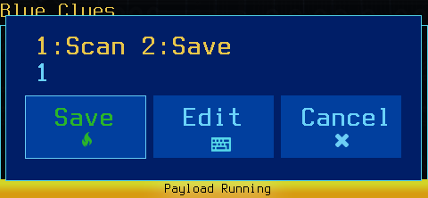
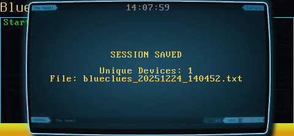

# Blue Clues

**Blue Clues** is a Bluetooth reconnaissance tool for the WiFi Pineapple Pager. 

**Update (v2): Passive Scanning Mode**
This tool has been reworked to focus on stealth and autonomy. Instead of manual "scan-and-review" cycles, Blue Clues now acts as a **Passive Scanner**. You configure the duration and feedback behavior once, and the device runs silently in the background, only alerting you when a target is captured.

---

### Features
* **Passive/Silent Operation:** The screen remains dark during operation to maintain stealth.
* **Custom Feedback:** Configure alerts (LED, Vibe, Both, or Silent) to trigger *only* when a new device is found.
* **Auto-Logging:** All findings are appended to a local file in real-time.
* **Timestamped Entries:** Every captured device is logged with the exact time of discovery.

---

### Workflow Tutorial

**1. Workflow Briefing**
The payload begins by outlining the passive scanning process.


**2. Feedback Configuration**
First, decide how the device should alert you when a Bluetooth device is detected.
* **Silent:** Logs data but gives no physical cue.
* **LED/Vibe:** Visual or haptic confirmation of a capture.


**3. Select Mode**
Use the number picker to confirm your feedback selection.


**4. Set Duration**
Enter the duration for the passive scan (in minutes). The device will loop continuously for this timeframe.


**5. Start Run**
The device confirms your settings. Once you press **OK**, the screen goes dark and the passive scan begins.
* *Note: Press Cancel at any time to abort the session.*


---

### Log Format
Files are saved as `blueclues_YYYYMMDD_HHMMSS.txt` in the script directory.

```text
18:05:01    00:11:22:33:44:55    Mike's iPhone
18:05:12    AA:BB:CC:DD:EE:FF    Tesla Model 3