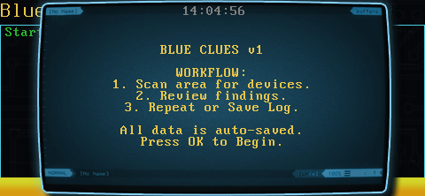
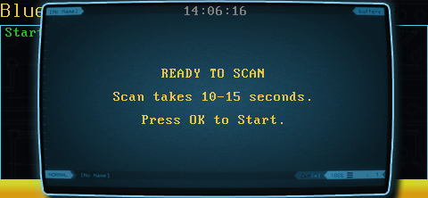

# Blue Clues v1

**Blue Clues** is a Bluetooth reconnaissance tool for the WiFi Pineapple Pager. It scans for visible devices, identifies their "Friendly Names," and automatically catalogs them into a timestamped log.

---

### Features
* **Active Recon:** Identifies discoverable devices via `hcitool`.
* **Auto-Logging:** Saves all findings to a local file in real-time.
* **Hardware Feedback:** Uses D-Pad LEDs (Red/Green/Blue) and haptics.
* **Menu Workflow:** Option to continuously scan new areas or finalize the session.

---

### Workflow Tutorial

**1. Launch**
The briefing screen confirms the tool is ready.


**2. Scan**
Press **OK** to start. The inquiry takes **10-15 seconds** (Blue LEDs active).


**3. Review**
* **Red LED + Vibe:** Devices found.
* **Green LED:** No devices found.


**4. Action Menu**
* **Scan:** Return to ready state (keep adding to current log).
* **Save:** End session and close file.


**5. Complete**
Displays total unique devices found and the saved filename.


---

### Log Format
Files are saved as `blueclues_YYYYMMDD_HHMMSS.txt` in the script directory.

```text
Scanning ...
00:11:22:33:44:55       Mike's iPhone
AA:BB:CC:DD:EE:FF       Tesla Model 3